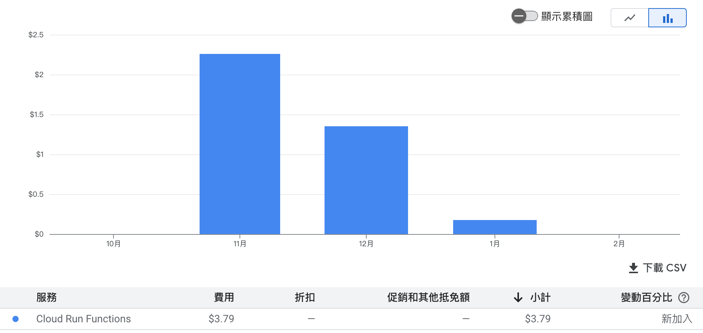

# 2023 芳和越野路跑成績查詢系統

> 進步，往往開始於一個小小的細節

越野路跑是芳和實驗中學的一項傳統活動，每到11月左右時便會由應屆高二舉辦，全校都要參與。而2023便是我升上高二的那年，我們要舉辦越野路跑。我的組別是資訊組，主要負責網站架設與活動宣傳。網頁架設並不困難，不消幾天便透過協作平台搭設完成。

但我有個計畫，上一屆的成績公布是透過將成績試算表共用出來供大家查詢。而這次，我想做個 __成績查詢系統__ 。

## 成果展示

網站連結：[https://sites.google.com/fhehs.tp.edu.tw/fhrun2nd/%E6%88%90%E7%B8%BE%E5%85%AC%E5%91%8Aresult](https://sites.google.com/fhehs.tp.edu.tw/fhrun2nd/%E6%88%90%E7%B8%BE%E5%85%AC%E5%91%8Aresult)

測試號碼：老師, T-01

[使用片段](https://youtu.be/n7ZgSPV8Ns8) <- 換成gif>

使用量：

 

沒有記錄到人數所以只能這樣呈現了，每次請求大概會消耗0.02元。總共使用了3.79元，所以使用人數大約是200人。

## 系統實現

前端的網頁我使用Google提供的GCP進行架設，後端的資料查詢部分則是使用Google試算表提供的Google Apps Script進行查詢。

流程圖如下：

## 未來展望

未來還有以下幾點可以做更改：

- 打號碼還要選年級有點反直覺，如果可以自動查詢所有表的話就不必這樣做了。
- GCP 貴到嚇死人，下次搬去別的平台試試
- 用 Python 寫網站有點彆扭，下次用 JavaScript
