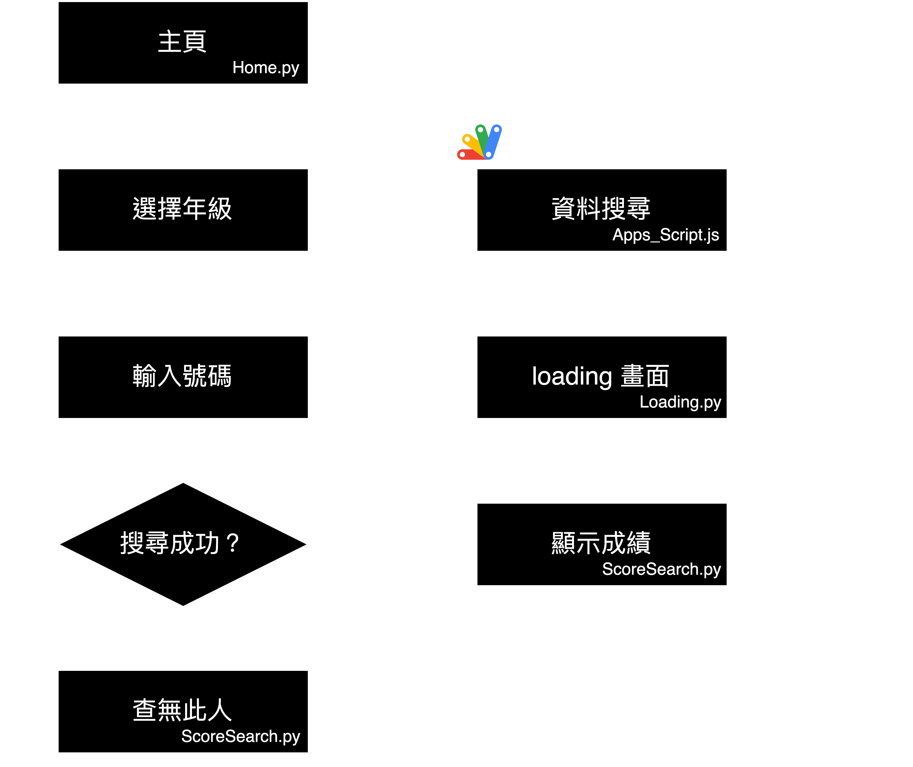

# 2023 芳和越野路跑成績查詢系統

> 進步，往往開始於一個小小的細節

越野路跑是芳和實驗中學的一項傳統活動，每到11月左右時便會由應屆高二舉辦，全校都要參與。而2023便是我升上高二的那年，我們要舉辦越野路跑。我的組別是資訊組，主要負責網站架設與活動宣傳。網頁架設並不困難，不消幾天便透過協作平台搭設完成。

但我有個計畫，上一屆的成績公布是透過將成績試算表共用出來供大家查詢。而這次，我想做個 __成績查詢系統__ 。

## 成果展示

[使用片段](https://youtu.be/n7ZgSPV8Ns8) <- 換成gif>

使用量：

[網站連結](https://sites.google.com/fhehs.tp.edu.tw/fhrun2nd/%E9%A6%96%E9%A0%81home)

## 系統實現

前端的網頁我使用Google提供的GCP進行架設，後端的資料查詢部分則是使用Google試算表提供的Google Apps Script進行查詢。

流程圖如下：

